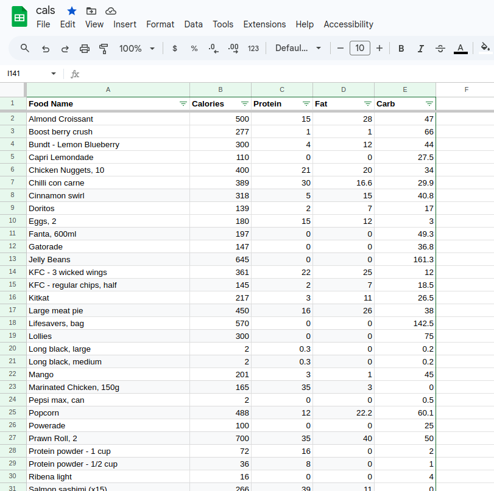

# Calorie Bot

A Telegram bot that uses Claude AI to extract macros from food photos and logs them to a Google Sheet.

Send a photo of food, a nutrition label, or a meal to the bot and it will automatically add a row to your Google Sheets food database with the estimated calories, protein, fat, and carbs.

You can also add a caption to the photo (e.g. "Chicken schnitzel") to help the AI identify the food correctly.

## How it works

1. You send a photo to the Telegram bot from your phone
2. The bot downloads the image and sends it to the Claude API (vision)
3. Claude extracts the macros and returns structured JSON
4. The bot writes a new row to the `FoodDatabase` sheet in your Google Sheet
5. The bot replies with a confirmation message showing what was logged

The bot runs on your own machine using Telegram's polling mechanism — it continuously checks for new messages and processes them locally. Your machine needs to be on and connected to the internet for the bot to work.

## Requirements

- Python 3.10+
- A Telegram account
- An Anthropic API account (pay-as-you-go credits)
- A Google Cloud project with the Sheets and Drive APIs enabled
- Linux with systemd (for running as a background service)

## Setup

### 1. Clone and install

```bash
git clone https://github.com/YOUR_USERNAME/calorie-bot.git
cd calorie-bot
python3 -m venv venv
source venv/bin/activate
pip install python-telegram-bot anthropic gspread google-auth python-dotenv
```

### 2. Create a Telegram bot

1. Open Telegram and search for **@BotFather**
2. Send `/newbot` and follow the prompts to choose a name and username
3. BotFather will give you a token like `1234567890:AAF...` — copy it

### 3. Get your Telegram user ID

1. Search for **@userinfobot** on Telegram and start it
2. It will reply with your numeric user ID — copy it

This is used to restrict the bot so only you can use it.

### 4. Get a Claude API key

1. Sign up at [console.anthropic.com](https://console.anthropic.com)
2. Go to **API Keys** → **Create Key** — copy it (shown once only)
3. Add billing credits under **Plans & Billing** (pay-as-you-go, not a subscription)

### 5. Set up Google Sheets

1. Go to [console.cloud.google.com](https://console.cloud.google.com) and create a new project
2. Go to **APIs & Services** → **Enable APIs** and enable both:
   - **Google Sheets API**
   - **Google Drive API**
3. Go to **IAM & Admin → Service Accounts** → **Create Service Account**
4. Give it a name, skip the optional steps
5. Click the service account → **Keys** → **Add Key** → **JSON** — this downloads a credentials file
6. Move the credentials file into the project directory:
   ```bash
   mv ~/Downloads/your-credentials-file.json ~/calorie-bot/credentials.json
   ```
7. Open your Google Sheet → **Share** → add the service account email (looks like `name@project.iam.gserviceaccount.com`) with **Editor** access

### 6. Set up your Google Sheet

Make sure your sheet has a tab called `FoodDatabase` with these columns:

| A | B | C | D | E |
|---|---|---|---|---|
| Food Name | Calories | Protein | Fat | Carb |



### 7. Configure secrets

```bash
cp .env.example .env
```

Edit `.env` with your values:

```
TELEGRAM_TOKEN=        # From BotFather
ANTHROPIC_API_KEY=     # From console.anthropic.com
GOOGLE_SHEETS_CREDS=   # Filename of your credentials JSON file (e.g. credentials.json)
SPREADSHEET_NAME=      # Exact name of your Google Sheet
ALLOWED_USER_ID=       # Your numeric Telegram user ID from @userinfobot
```

### 8. Test it manually

Before setting up the background service, verify everything works:

```bash
source venv/bin/activate
python3 bot.py
```

You should see `Bot started`. Open Telegram, find your bot, and send it a photo of food. If it replies with macros and you see a new row in your sheet, everything is working.

Press `Ctrl+C` to stop it when done testing.

### 9. Run as a background service (Linux/systemd)

This sets the bot up to run permanently in the background, start automatically on boot, and restart itself if it crashes.

```bash
sudo cp calorie-bot.service /etc/systemd/system/
sudo systemctl daemon-reload
sudo systemctl enable --now calorie-bot
```

Check it's running:

```bash
sudo systemctl status calorie-bot
```

View live logs:

```bash
journalctl -u calorie-bot -f
```

### 10. Auto-restart on file changes

This sets up a watcher so the bot automatically restarts whenever you edit `bot.py` or `.env`, without needing to manually run `sudo systemctl restart calorie-bot`.

```bash
sudo cp calorie-bot-env-watch.path /etc/systemd/system/
sudo cp calorie-bot-env-watch.service /etc/systemd/system/
sudo systemctl daemon-reload
sudo systemctl enable --now calorie-bot-env-watch.path
```

## Managing the service

```bash
# Check status
sudo systemctl status calorie-bot

# View logs (live)
journalctl -u calorie-bot -f

# Restart manually
sudo systemctl restart calorie-bot

# Stop
sudo systemctl stop calorie-bot

# Disable autostart on boot
sudo systemctl disable calorie-bot
```

## Secrets reference

| Secret | Where to get it |
|--------|----------------|
| `TELEGRAM_TOKEN` | @BotFather on Telegram |
| `ANTHROPIC_API_KEY` | console.anthropic.com → API Keys |
| `GOOGLE_SHEETS_CREDS` | Google Cloud Console → Service Account → JSON key filename |
| `SPREADSHEET_NAME` | The exact name of your Google Sheet |
| `ALLOWED_USER_ID` | Your numeric Telegram user ID — get it from @userinfobot |
